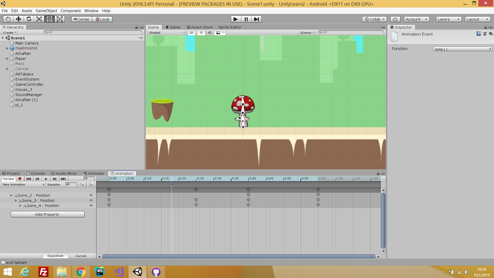
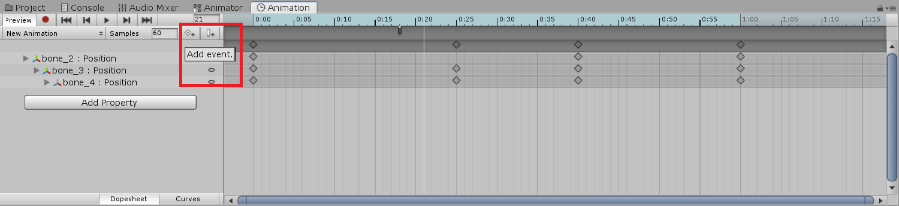
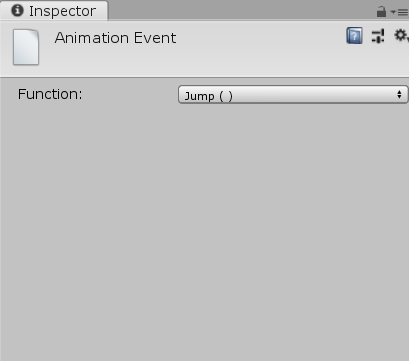
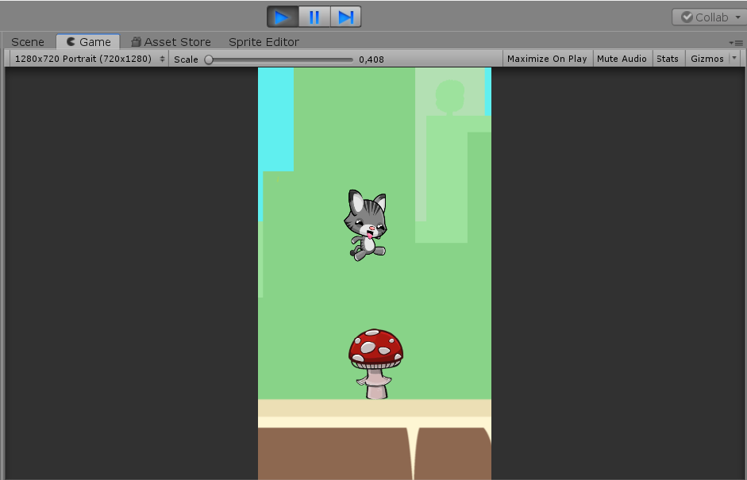

# Trampoline-Unity

Hello to everyone! How to make with Unity Trampoline Jumper? Lets do this!

# Trampoline Script

You could download "trampoline.cs". If you dont have a trampoline game object, you could add some image for trampoline. Then you could add trampoline.cs for the game object. 

You can see that.

Bouncer == player let's do this. After you could set Velocity. Make your own game in an appropriate setting.

# Trampoline Animator Could Jump Function

This is so important. If you miss this, your trampoline dont work.

#### Step 1:

Trampoline animator should have event for jump function. How to add event? Let's look screenshot. 

#### Step 2:

You could select jump function. The screen is right-top.

# Let's Jump with Character 

Dont forget. You could add box-collider2d at your trampoline. Trampoline have animator. And Animator is working with your jump function. 

