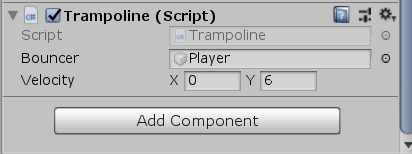

# Trampoline-Unity

Hello to everyone! How to make with Unity Trampoline Jumper? Lets do this!

# Trampoline Script

You could download "trampoline.cs". If you dont have a trampoline game object, you could add some image for trampoline. Then you could add trampoline.cs for the game object. 

You can see that.

